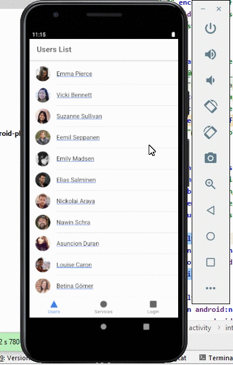

# hands-on-app

 

Mobile hybrid app for Android platform to display contacts and update avatar using camera functionalities with Capaitor, developed on Ionic framework v6.11.0 with redux-thunk for the data layer.

## API 

for this app I'm using randomuser API ("https://randomuser.me/api/?results=100") I'm limiting the result to a hundred just to test the pagination of the infity scroll performance in the user list.

## Available Scripts

Node & Ionic CLI must be installed befor run tese scripts

In the project directory, you can run:

### `npm install`

install all dependencies and add node_modules folder, do this before run the app.

The page will reload if you make edits. 
You will also see any lint errors in the console.

### `npm start`(ionic serve)

Runs the app in the development mode. 
Open [http://localhost:3000](http://localhost:3000) to view it in the browser.

The page will reload if you make edits. 
You will also see any lint errors in the console.

### `ionic build`

Builds the app for production to the `build` folder. 
It correctly bundles React in production mode and optimizes the build for the best performance.

The build is minified and the filenames include the hashes. 
Your app is ready to be deployed!

See the section about [deployment](#deployment) for more information.

### `ionic capaitor run android `

Open the app in Android Studio, from there you can run on a device or an emulator and deploy APK file.
